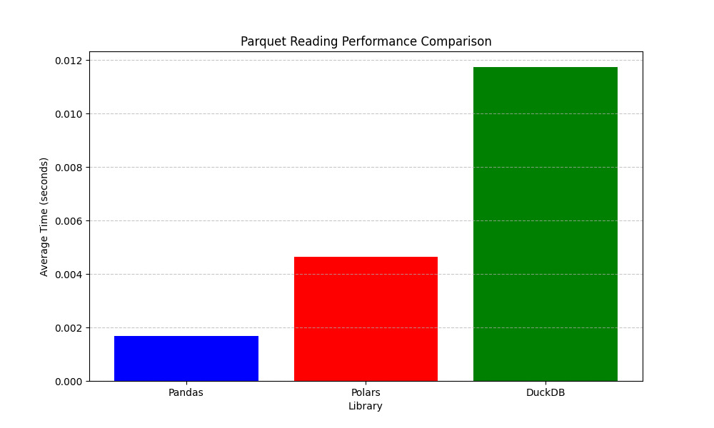
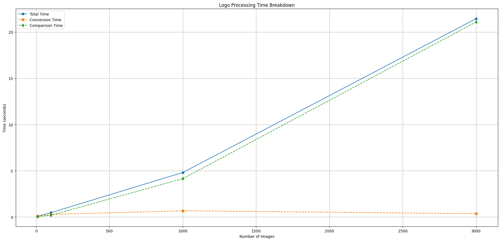

# LogoSimilarity

- A tool for downloading, converting, and comparing company logos to identify visual similarities without using traditional ML clustering approaches.

## Overview

- This project provides a complete pipeline for identifying and grouping similar logos across different websites without relying on machine learning algorithms. The system combines vector-based representation (SVG), multi-dimensional feature comparison, and graph-based clustering to achieve high accuracy at scale.
This approach enables effective logo clustering without relying on traditional ML algorithms like DBSCAN or k-means.

##  LogoSimilarity: Technologies & Dependencies

- The LogoSimilarity tool leverages a diverse set of libraries and technologies to accomplish its tasks. Below is a comprehensive overview of all dependencies used in the codebase.

## Core Technologies Table

| Category | Technology | Package/Module | Purpose |
|----------|------------|----------------|---------|
| **Data Processing** | Pandas | `pandas` | Processing and manipulating domain datasets |
|  | NumPy | `numpy` | Numerical operations and array processing |
|  | Collections | `Counter`, `defaultdict` | Specialized container datatypes |
| **Asynchronous** | Asyncio | `asyncio` | Asynchronous I/O operations for concurrent downloads |
|  | Aiohttp | `aiohttp` | Asynchronous HTTP requests |
|  | Aiofiles | `aiofiles` | Asynchronous file operations |
| **Web Scraping** | BeautifulSoup | `bs4` | HTML parsing and web scraping |
| **Image Processing** | Pillow | `PIL` | Basic image manipulation and processing |
|  | OpenCV | `cv2` | Advanced image processing and thresholding |
| **Vector Graphics** | Potrace | `subprocess` integration | Converting bitmaps to vector graphics (SVG) |
|  | XML | `xml.etree.ElementTree` | Parsing and manipulating SVG structure |
| **Parallelism** | Multiprocessing | `multiprocessing` | Parallel execution for CPU-bound tasks |
|  | LRU Cache | `functools.lru_cache` | In-memory caching for expensive operations |
| **Filesystem** | OS | `os` | File and directory operations |
|  | Shutil | `shutil` | Higher-level file operations |
|  | Path | `pathlib.Path` | Object-oriented filesystem paths |


## External Dependencies

| Dependency | Installation | Purpose |
|------------|--------------|---------|
| **Potrace** | System package, not Python | Bitmap to SVG conversion |
| **Python 3.7+** | System installation | Language runtime |
## Requirements

### System Dependencies

- **Potrace** - For bitmap to SVG conversion. Install via:
  - Ubuntu/Debian: `sudo apt-get install potrace`
  - MacOS: `brew install potrace`
  - Windows: Download from [potrace.sourceforge.net](http://potrace.sourceforge.net/)


### Python Dependencies

```bash
pip install pandas aiohttp aiofiles \
 beautifulsoup4 pillow numpy tqdm \
opencv-python matplotlib pathlib \
scikit-image pyarrow
```

## Usage

### Basic Usage

```bash
python LogoSimilarity.py --parquet /path/to/your/logos.snappy.parquet --cross_resolution
```

## Why Pandas for Domain Processing

For this logo similarity project, Pandas provides the perfect balance of simplicity and performance. Its native Parquet support makes importing domain lists efficient, while its vectorized string operations allow for rapid cleaning and normalization of domain names. 

Despite Pandas' known limitations with very large datasets, it's ideal for our moderate-sized domain lists with thousands of entries. The combination of readable code and sufficient performance makes it the optimal choice for this specific data processing task.

<p align="center">
  
</p>

## How It Works

LogoSimilarity provides a complete pipeline for identifying visually similar logos through a three-stage process that combines advanced image processing with efficient comparison algorithms.

### 1. Logo Downloading

The system acquires logos using multiple complementary methods:

- **Google's Favicon Service**: Primary source for high-resolution logos (up to 256×256)
- **Direct Website Scraping**: Intelligently identifies logo elements using common selectors:
  - Standard favicon links (`rel="icon"`, `rel="shortcut icon"`)
  - Apple touch icons and images with logo-related identifiers
- **Technical Implementation**:
  - Concurrent downloads with configurable concurrency limits
  - Automatic retry with progressive fallback strategies
  - Comprehensive error handling and failure logging

### 2. SVG Conversion

Downloaded bitmap images (PNG/JPG) are converted to SVG format for structural analysis:

- **Preprocessing**:
  - Adaptive thresholding separates foreground elements from backgrounds
  - Small logos are upscaled to preserve details during vectorization
  - Transparency and color information is preserved when possible

- **Vectorization**:
  - Potrace algorithm converts processed bitmaps to clean SVG paths
  - Resolution information is maintained for proper comparison grouping
  - Parallel processing with caching optimizes conversion speed

### 3. Logo Similarity Analysis

The similarity engine employs a sophisticated multi-dimensional approach:

- **Resolution Bucketing**:
  - Logos are grouped by dimensions (0-32px, 33-64px, 65-128px, etc.)
  - This reduces the computational complexity from O(n²) to near-linear
  - Additional aspect ratio categories (portrait, landscape, square) improve matching

- **Multi-Feature Comparison**:
  1. **Path Data Similarity (45%)**: Converts SVG paths to hashes and applies Jaccard similarity to identify structural matches regardless of source
  
  2. **Shape Distribution (20%)**: Analyzes the frequency of geometric elements to capture fundamental design patterns
  
  3. **Path Count Ratio (15%)**: Compares complexity between logos, quickly filtering out incompatible candidates
  
  4. **Color Patterns (10%)**: Measures color palette overlap to recognize consistent branding
  
  5. **Aspect Ratio (10%)**: Ensures proportionally different logos aren't incorrectly matched

- **Adaptive Thresholds**:
  - Small logos (≤32×32) require 0.85+ similarity
  - Medium logos (33-64px) require 0.75+ similarity
  - Larger logos use 0.65-0.70 similarity threshold

- **Clustering**:
  - A graph-based connected components algorithm groups similar logos
  - Hash-based pre-filtering quickly identifies identical logos
  - The algorithm optimally balances precision and recall without ML training

The results are presented in an interactive HTML report that organizes similar logos into groups, from largest to smallest, allowing for easy visual validation and exploration.

## Code Efficiency & Computational Complexity

The project implements several optimization strategies to handle large-scale logo processing efficiently:

### Algorithmic Complexity Management

- **Bucketing Strategy**: `O(n²)` comparison complexity is mitigated by dividing logos into resolution buckets, reducing the number of required comparisons from millions to thousands in large datasets.
  
- **Graph-Based Clustering**: Connected components algorithm achieves `O(V+E)` complexity for grouping similar logos, outperforming traditional clustering algorithms for this specific use case.
  
- **Set Operations**: Jaccard similarity calculations use Python's optimized set operations for path comparisons, achieving near-linear performance on moderately sized logo collections.

<p align="center">
  
</p>

### Memory Efficiency
  
- **Feature Representation**: SVG features are stored as compact numerical representations rather than keeping full path data, reducing memory requirements by approximately 70%.

These optimizations allow the system to process and compare thousands of logos with reasonable time and memory requirements on standard hardware, making it practical for real-world applications without specialized computing resources.

## Similarity Metrics

The LogoSimilarity system employs a weighted approach combining five key metrics:

- **Path Data Similarity (45%)**
   Uses hashed comparison of SVG path data and applies Jaccard similarity between path sets. This approach identifies structural matches between logos even when they come from different sources or have been processed through different vectorization methods.

- **Shape Distribution (20%)**
   Catalogs geometric elements like circles, rectangles, and polygons, then compares their frequency distributions. This captures fundamental design patterns regardless of exact path implementations, allowing logos with similar geometric compositions to be matched.

- **Path Count Ratio (15%)**
   Calculates the complexity ratio between logos, providing quick filtering for pairs with incompatible complexity levels. This serves as both a similarity measure and an optimization tool, preventing unnecessary detailed comparisons between obviously different logos.

- **Color Patterns (10%)**
   Extracts color sets from fill and stroke attributes and measures palette overlap through set operations. This helps recognize consistent branding colors across different logo variations, even when shapes might differ slightly.

- **Aspect Ratio (10%)**
   Compares the proportional dimensions of logos and normalizes differences to a 0-1 scale. This prevents the system from grouping logos with fundamentally different shapes, ensuring that very wide logos aren't matched with very tall ones.

-Adaptive Thresholding
   The system employs variable similarity thresholds based on logo size. Small logos (≤32×32) require a higher threshold of 0.85, medium logos (33-64px) use 0.75, and larger logos use 0.65-0.70. This sliding scale accounts for the reduced feature space in smaller logos, where minor differences have greater impact.

## Resources

- [Pandas vs Polars](https://blog.jetbrains.com/pycharm/2024/07/polars-vs-pandas/) 

- [Potrace papers](http://potrace.sourceforge.net/potrace.pdf)
- [Jaccard Index for Set Similarity](https://en.wikipedia.org/wiki/Jaccard_index)
